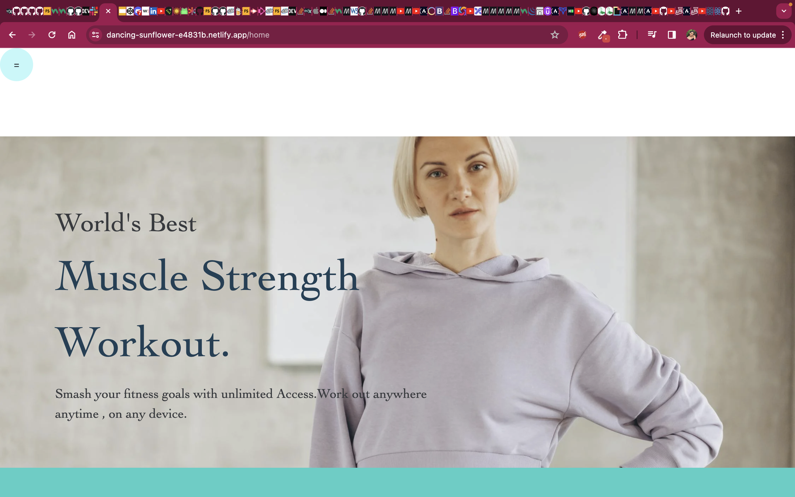
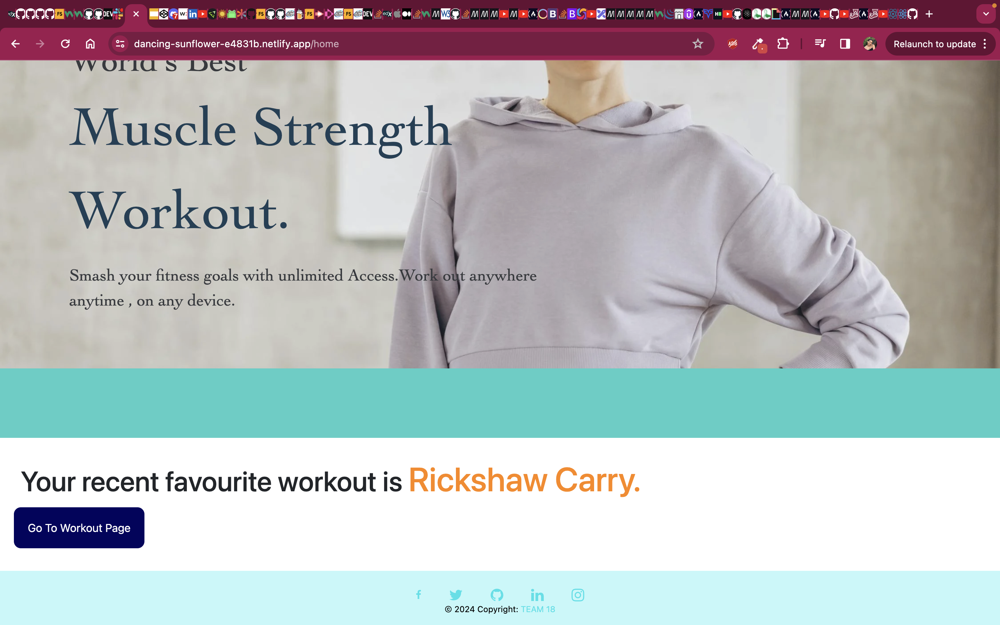
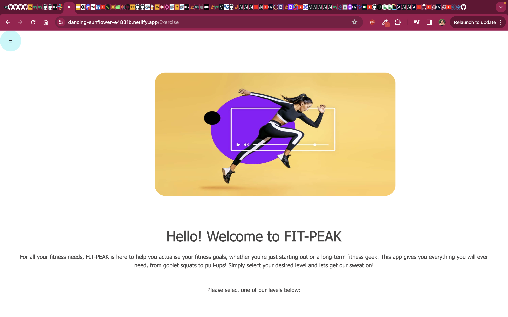
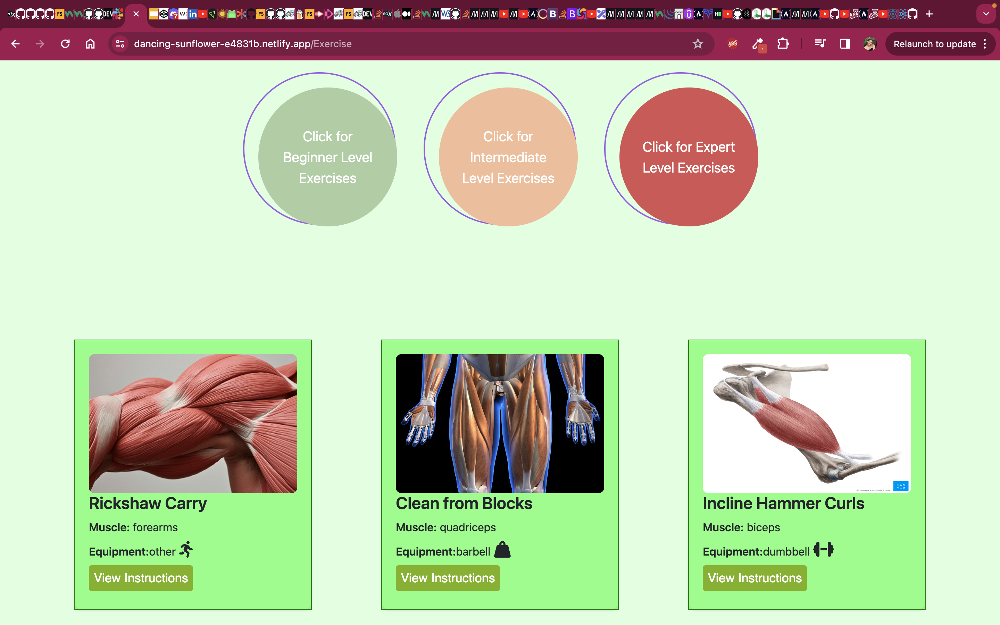
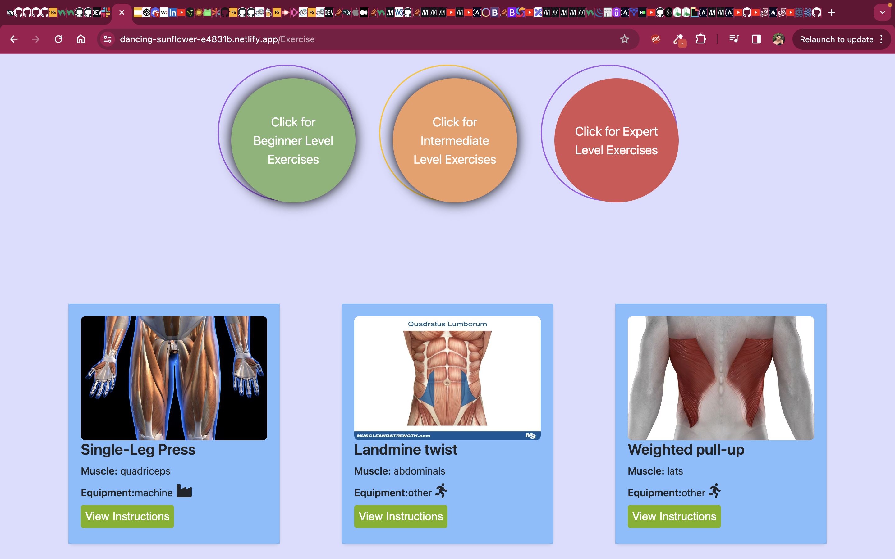
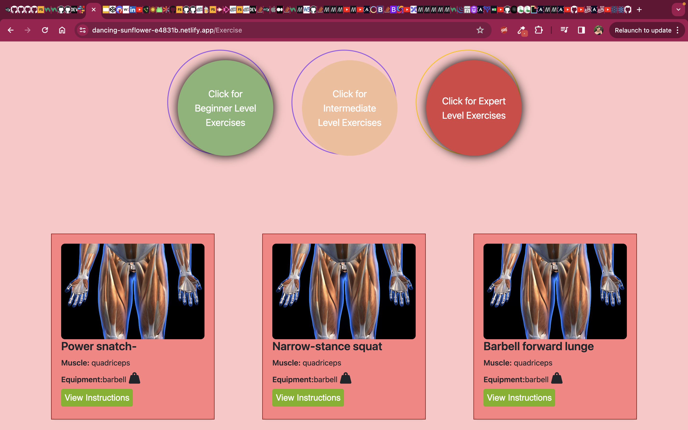
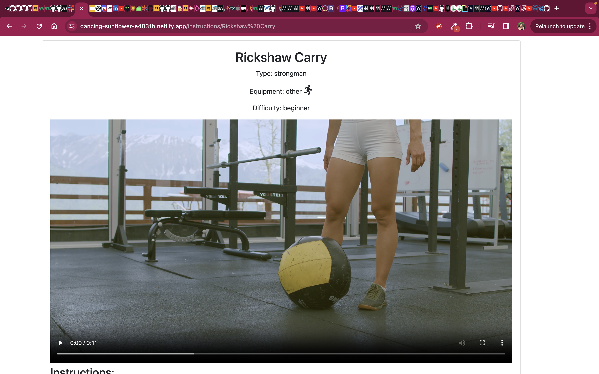
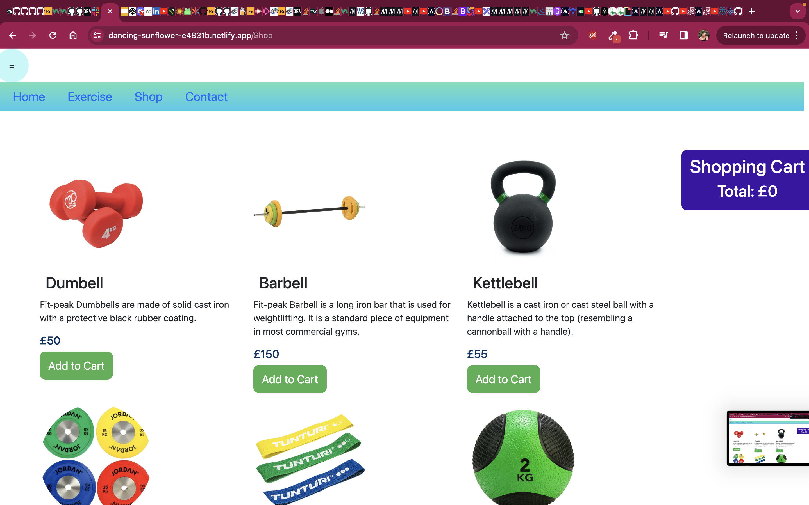

# Fit-Peak

## Decription

Welcome to the FIT-PEAK app. The only app that will let you explore different exercises, at different levels with detailed instructions and follow-along tutorials. This app will help you build the perfect fitness routine at a level that you are most comfortable. If you're a beginner or a fitness geek, you will find all that you need to on this app. We wanted to build this app because the gym can sometimes be really daunting, especially if you are a beginner, everyone seems to always know how to do everything! Our solution was to create an app where you can find easy step-by-step guidlines to an excersie that you want to try, and if reading isn't what you want to do in the gym then worry not! We've given you videos to help you improve your form!

We built this app because we understand that improving yourself can happen at any stage on your fitness journey, that's why we wanted to give you an app that you can use with ease and feel taken care of. We have a wide variety of exercises available so whatever you think of working out next, we have it! And the best part?! All of your exercises are saved for when you want to repeat a workout! No need to endlessly scroll looking for THE ONE!

With this project we learnt how to work as a team. This was cruicial for our project, by respecting and communicating with each other we were able to get a fully functioning app working.

We think that this project makes us standout because we have a fun spin on a fitness app and implented something that makes it more fun instead of just showing you the exercises. The videos and the store where you can purchase equipment that has been used here give the user a fun and rememorable expereience which will boost users to come back more!

## Usage

This should be used when inspiration is low on how to push yourself at the gym or when you're just starting out to give you a workout routine at you fingertips. Simply type in a workout, or the body part if you don't know what to workout, and we will give suggested workouts, simply scroll until you find one you're comfortable with, or uncomfortable with depending on your preferences and start!

## Installation

To access the deployed application head to: https://dancing-sunflower-e4831b.netlify.app/

## Instructions

To use the application, follow these steps:

1. Open the deployed application on the link provided above which will look like the following

2. Scroll down on the landing page slightly to the 'Go To Workout Page' button that looks like the following

3. Scroll down to select one of the difficulty levels and the following page will load depending on your choice

   

4. Choose a workout and the page will load with the workout, it will have written instructions and a video like the following

5. You can even navigate through this with the navbar at the top of the page

6. At the bottom of the workout page we have a button called 'Visit Our Store Page' it will look like the following and land you on our store page where you can purchase gym equipment

## Credits

Vytautas Venckunas
Niroshi Lawinjeya
Kamila Wroblewska
Hannah Hazel
